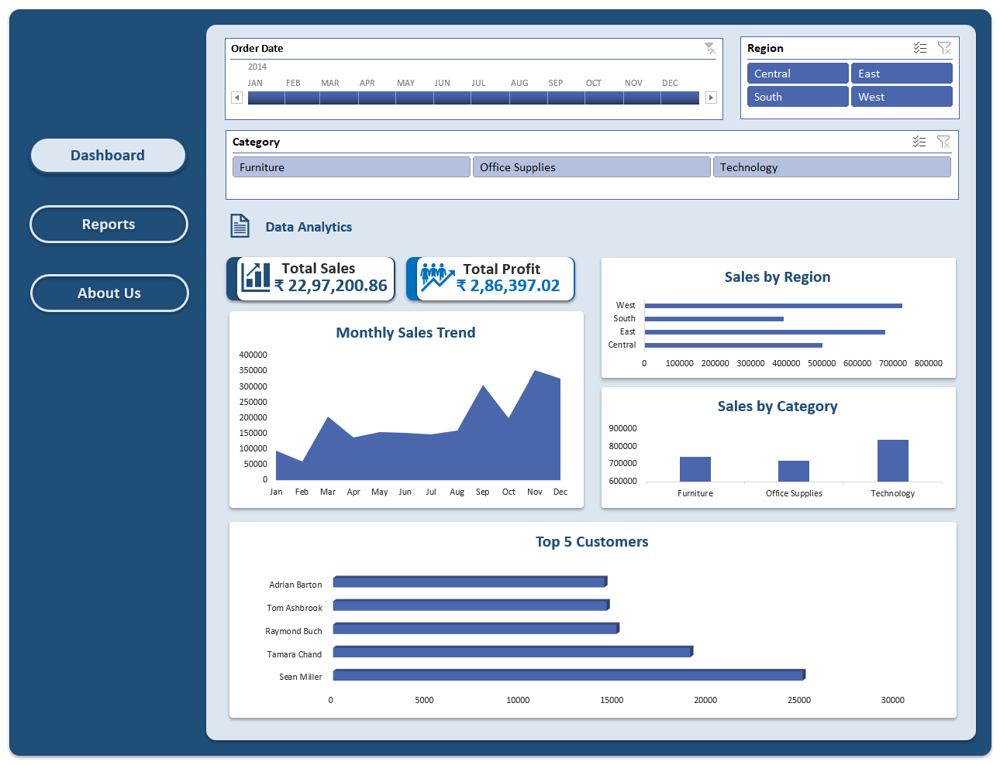

# 📊 Sales Data Analysis Project (Excel + SQL)

## 📊 Dashboard Preview

An end-to-end retail sales performance analysis project demonstrating SQL data querying, Excel dashboard development, and business insight generation.

This project simulates a real-world scenario where business stakeholders require actionable insights from transactional sales data.

---

## 🎯 Business Problem

A retail company wants to understand its sales performance across categories, regions, and time periods.

Management needs answers to:

- Which product categories generate the highest revenue and profit?
- Which regions are underperforming?
- How does monthly and yearly performance trend over time?
- Which categories have low profit margins despite high sales?

The goal is to use data-driven analysis to identify growth opportunities and improve profitability.

## 🚀 Project Overview

This project analyzes retail sales data to:

- Identify top-performing categories and regions
- Calculate profit margins
- Detect most profitable month-region combinations
- Build an interactive Excel dashboard
- Generate business insights using SQL

## 🛠 Tech Stack

- Excel (Dashboard, Pivot Tables, Charts)
- SQL (PostgreSQL)
- Data Cleaning & Aggregation
- Window Functions
- Git & GitHub

---

# PART 1: Excel Dashboard

## 🎯 Objective

Build an interactive Sales Performance Dashboard.

## 📊 Features:

- Total Sales KPI
- Total Profit KPI
- Sales by Region
- Sales by Category
- Monthly Sales Trend
- Slicers (Region, Category, Year)

## 🛠 Tools Used:

- Pivot Tables
- Pivot Charts
- Slicers
- KPI Cards
- Dashboard Design

---

# PART 2: SQL Analysis (PostgreSQL)

## 🎯 Objective

Perform structured data analysis using SQL queries.

## 🔍 Analysis Performed:

1. Total Sales
2. Total Profit
3. Sales by Category
4. Profit by Category
5. Sales by Region
6. Profit by Region
7. Monthly Sales Trend
8. Most Profitable Month
9. Most Profitable Region-Month Combination
10. Profit Margin by Category
11. Top 5 Customers by Sales

---

## 📊 Key Business Insights

- 🏆 The Technology category was the primary revenue and profit driver, indicating strong demand and pricing power.
- 📍 The West region consistently outperformed other regions in profitability, suggesting effective regional strategy.
- 📅 Sales peaked in January 2014, highlighting strong seasonal performance.
- ⚠️ Office Supplies showed relatively lower profit margins, indicating potential pricing or cost optimization opportunities.
- 📈 Profit margin varied significantly across categories, suggesting room for strategic product mix adjustments.

---

## 🧠 Skills Demonstrated

- SQL Aggregations
- GROUP BY & ORDER BY
- Date Functions (TO_CHAR, DATE_TRUNC)
- Ranking & Filtering
- Profit Margin Calculation
- Business Insight Generation
- Dashboard Building in Excel

---

## 📊 Download Dashboard

[⬇ Download Excel Dashboard](./Sales_Performance_Dashboard.xlsx)

## 📂 Project Structure

- 📄 [sales_analysis.sql](./sales_analysis.sql)
- 📘 [README.md](./README.md)
- 📊 [Sales_Performance_Dashboard.xlsx](./Sales_Performance_Dashboard.xlsx)
- 📁 [dataset.csv](./dataset.csv)

---

## ▶ How to Use This Project

1. Download the dataset (`dataset.csv`)
2. Open `Sales_Performance_Dashboard.xlsx` to explore the interactive dashboard
3. Run `sales_analysis.sql` in PostgreSQL to reproduce the SQL analysis
4. Compare SQL insights with Excel dashboard findings

---

## 💼 Business Impact

This project demonstrates how structured data analysis can support business decision-making.

The dashboard enables stakeholders to:

- 📊 Monitor overall sales and profitability performance
- 🌍 Identify high-performing regions and underperforming segments
- 📦 Optimize product category strategies based on profit margins
- 📅 Track seasonal sales trends for better forecasting
- 🎯 Make data-driven decisions using clear, visual insights

By combining SQL-based analysis with Excel dashboards, the project simulates a real-world business intelligence workflow from raw data to executive-level reporting.

---

#🚀 Author

Anurag Kumar 
